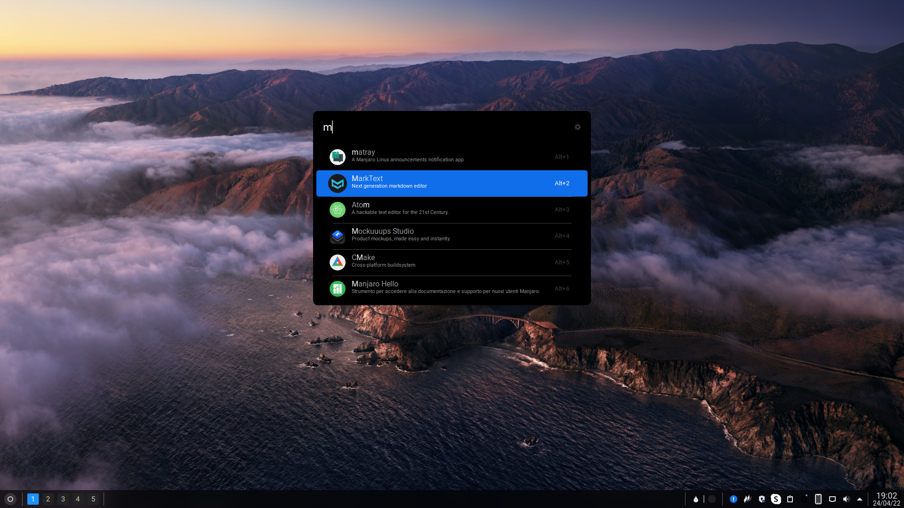

# Essential Dark Theme - Ulauncher
A theme for Ulauncher. Essential Dark Theme.


## Screenshot


## Installation
```sh
mkdir -p ~/.config/ulauncher/user-themes
git clone https://github.com/GiorgioReale/Ulauncher-Essential-Dark-Theme.git \
  ~/.config/ulauncher/user-themes/Essential-Dark-Theme
```
### Light Theme:
[Essential Light Theme](https://github.com/GiorgioReale/Ulauncher-Essential-Light-Theme)
